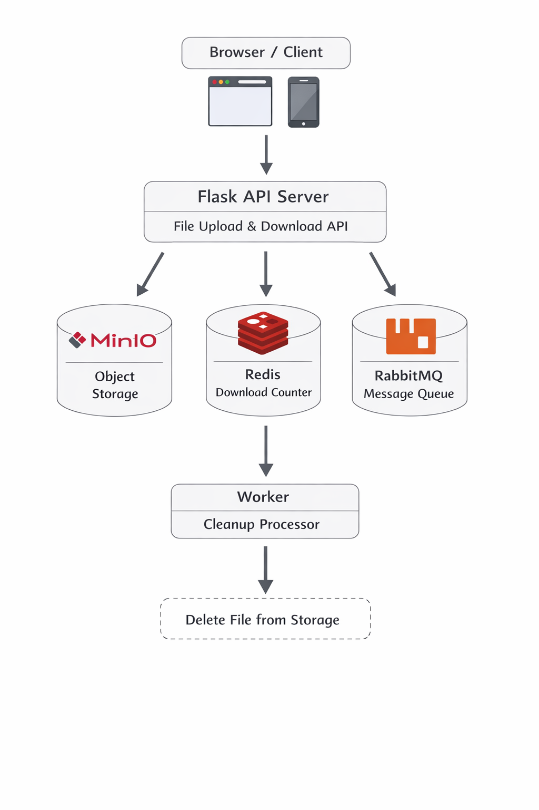

# HỆ THỐNG LƯU TRỮ ẢNH PHÂN TÁN CÓ KHẢ NĂNG TỰ PHỤC HỒI VÀ XỬ LÝ HẬU KỲ BẤT ĐỒNG BỘ

## 1. Giới thiệu

Đồ án này xây dựng một **hệ thống lưu trữ ảnh phân tán có khả năng tự phục hồi**, cho phép người dùng upload ảnh, tải về với số lượt tải giới hạn, và tự động xóa sau hết hạn. Ảnh sẽ được **xử lý bất đồng bộ** (nén, tạo thumbnail) mà không làm nghẽn server chính.

### 1.1 Mục tiêu hệ thống

* **Khả năng mở rộng (Scalability)**: Xây dựng hệ thống có thể mở rộng bằng cách thêm nhiều node lưu trữ để tăng dung lượng và throughput.
* **Tính sẵn sàng cao (High Availability)**: Đảm bảo hệ thống hoạt động liên tục ngay cả khi một hoặc nhiều node bị sự cố.
* **Tự phục hồi (Fault Tolerance)**: Tự động sao chép dữ liệu (replication) giữa các node để đảm bảo dữ liệu không bị mất.
* **Xử lý bất đồng bộ (Asynchronous Processing)**: Tối ưu hóa hiệu suất bằng cách xử lý các tác vụ nặng (nén ảnh, tạo thumbnail) trên worker riêng biệt, không block API server.
* **Quản lý Metadata phân tán**: Lưu trữ và quản lý metadata (UUID, file_id, node_url) để cho phép tra cứu nhanh và chính xác.

### 1.2 Ứng dụng

Hệ thống này làm **nền tảng lưu trữ cho các ứng dụng web** hiện đại cần:
* Xử lý lượng lớn dữ liệu hình ảnh từ người dùng
* Không làm nghẽn server chính khi xử lý hoặc lưu trữ ảnh
* Đảm bảo dữ liệu không bị mất dù có sự cố phần cứng
* Phục vụ hàng triệu người dùng đồng thời

**Ví dụ**: Social media, cloud storage, e-commerce, CDN, gallery aplikasi...

### 1.3 Lý do triển khai

Thay vì sử dụng các giải pháp có sẵn như **MinIO, AWS S3, Google Cloud Storage**, việc **tự xây dựng từ đầu** giúp:
* **Hiểu sâu về cơ chế điều phối dữ liệu (Data Orchestration)** trong môi trường phân tán
* **Nắm vững quản lý Metadata** và cách thực hiện UUID identification
* **Học hỏi về High Availability**: Replication, Health Monitoring, Failover
* **Thành thạo Message Queue & Asynchronous Job Processing**
* **Áp dụng Distributed Locking** và Caching trong thực tế
* **Tự tin thiết kế kiến trúc phân tán** cho các dự án thực tế

### 1.4 Các khái niệm chính được áp dụng

* **Distributed Architecture**: Tách hệ thống thành nhiều thành phần độc lập giao tiếp qua network
* **Message Queue (RabbitMQ)**: Tách biệt API Server và Worker, cho phép xử lý bất đồng bộ
* **Data Replication**: Sao chép dữ liệu trên nhiều node để đảm bảo không mất dữ liệu
* **Metadata Management**: Lưu thông tin file (UUID, title, node_url) để tra cứu nhanh
* **Caching Layer (Redis)**: Tăng tốc độ truy vấn thông qua cache và locking distributed
* **Load Balancing**: Cân bằng tải giữa nhiều API instances
* **Health Monitoring & Failover**: Tự động chuyển đổi khi có node bị sự cố

---

## 2. Công nghệ sử dụng & Ánh xạ chương chấm điểm

| Công nghệ | Thành phần | Vai trò | Chương liên quan |
|-----------|-----------|--------|------------------|
| Flask (Python) | API Gateway | Điều phối toàn bộ hệ thống, nhận upload/download | Chương 1, 2 |
| Nginx | Load Balancer | Cân bằng tải, failover | **Chương 8**: Load Balancing |
| Local Disk | Storage Nodes | Lưu trữ ảnh vật lý trên ổ đĩa | Chương 1 |
| SQLite | Database | Lưu Metadata (UUID, file_id, title, node_url) | **Chương 5**: UUID Identification |
| Redis | Cache & Counter | Distributed Locking (Redlock), Caching, Download Counter | **Chương 4, 6**: Locking, Caching |
| RabbitMQ | Message Queue | Hàng đợi cho asynchronous background jobs | **Chương 3, 4**: Async Processing |
| Python Worker | Image Processor | Xử lý ảnh (nén, thumbnail) | **Chương 3**: Background Jobs |
| Replication Script | Data Replication | Sao chép dữ liệu tự động giữa các node | **Chương 7**: Data Replication |
| Docker Compose | Orchestration | Điều phối toàn bộ các container | Chương 1, 2 |

---

## 3. Kiến trúc hệ thống

### 3.1 Sơ đồ kiến trúc tổng quát



**Ghi chú**: Bạn cần vẽ sơ đồ này trên draw.io hoặc PlantUML. Xem hướng dẫn: [DRAW_GUIDE.md](DRAW_GUIDE.md)

### 3.2 Các vùng (Zones) trong kiến trúc

#### **🌐 CLIENT ZONE**
- Client Browser gửi HTTP request (POST /upload, GET /download)

#### **⚙️ ORCHESTRATION LAYER (Master Node)**
- **Load Balancer (Nginx)**: Cân bằng tải giữa nhiều API instances
- **API Gateway (Flask)**: Điều phối toàn bộ hệ thống, định tuyến request

#### **🗄️ MIDDLEWARE & DATA LAYER**
- **SQLite Database**: Lưu Metadata (UUID, file_id, title, node_url)
- **Redis Cache**: Distributed Locking (Redlock), Caching, Download Counter
- **RabbitMQ**: Message Queue cho asynchronous background jobs

#### **💾 STORAGE & PROCESSING LAYER (Slaves & Workers)**
- **Storage Node 1, 2, 3**: Lưu trữ ảnh vật lý (Local Disk)
  - Auto Replication: Sao chép dữ liệu tự động giữa các node
  - Failover: Nếu Node 1 chết → chuyển sang Node 2
- **Worker (Image Processor)**: Xử lý hậu kỳ (nén ảnh, thumbnail)

### 3.3 Mô tả vai trò các thành phần

* **Flask API Gateway**: Nhận request upload/download từ client, điều phối các dịch vụ còn lại.
* **Nginx Load Balancer**: Cân bằng tải giữa nhiều Flask instances, hỗ trợ failover.
* **Storage Nodes**: Lưu trữ ảnh upload trên ổ đĩa cục bộ (thay vì MinIO).
* **SQLite Database**: Lưu metadata file (UUID, title, node_url) để tra cứu nhanh.
* **Redis**: Lưu số lượt tải còn lại của mỗi file + distributed locking cho atomicity.
* **RabbitMQ**: Hàng đợi tin nhắn, giúp xử lý xóa file bất đồng bộ và xử lý ảnh.
* **Worker**: Tiến trình chạy độc lập, lắng nghe RabbitMQ và thực hiện xử lý ảnh nặng.

---

## 4. Luồng hoạt động của hệ thống

### 4.1 Luồng Upload Ảnh

1. **Client** → **Load Balancer**: Gửi POST request với ảnh
2. **Load Balancer** → **API Gateway**: Forwarding request (cân bằng tải)
3. **API Gateway** → **SQLite**: Lưu Metadata (UUID, title, node_url)
4. **API Gateway** → **Storage Node 1**: Lưu ảnh vật lý (chọn node dựa trên thuật toán)
5. **Storage Node 1** → **Storage Node 2**: Auto Replicate (sao chép dữ liệu)
6. **Storage Node 2** → **Storage Node 3**: Backup thêm 1 bản
7. **API Gateway** → **Redis**: Lưu download counter (3 lượt, TTL 1 giờ)
8. **API Gateway** → **RabbitMQ**: Đẩy message "Xử lý ảnh" và "Xóa sau hạn"
9. **RabbitMQ** → **Worker**: Worker nhận task
10. **Worker** → **Storage Node 1**: Đọc ảnh gốc
11. **Worker** → **Storage Node 1**: Lưu ảnh đã xử lý (nén, thumbnail)
12. **API Gateway** → **Client**: Trả về JSON với download link

### 4.2 Luồng Download Ảnh

1. **Client** → **Load Balancer**: Gửi GET request `/download/{file_id}`
2. **Load Balancer** → **API Gateway**: Forwarding request
3. **API Gateway** → **Redis**: Check cache
4. **API Gateway** → **SQLite**: Lấy `node_url` (node nào đang lưu file)
5. **API Gateway** → **Redis**: Kiểm tra download counter
6. **Nếu còn lượt**: **API Gateway** → **Redis**: Giảm counter đi 1
7. **API Gateway** → **Storage Node X**: Tải file từ node tương ứng
8. **API Gateway** → **Client**: Trả file (stream)

### 4.3 Luồng Xóa Ảnh (Worker)

1. **Worker** lắng nghe hàng đợi RabbitMQ
2. Nhận message chứa tên ảnh
3. Chờ 60 giây (đảm bảo không ai đang download)
4. **Worker** → **Storage Node X**: Xóa ảnh khỏi ổ đĩa
5. **Worker** → **SQLite**: Xóa metadata khỏi database
6. **Worker** → **Redis**: Xóa download counter
7. **RabbitMQ**: ACK message (xóa khỏi queue)

### 4.4 Luồng Health Monitoring & Failover

1. **API Gateway** định kỳ kiểm tra health của các Storage Node
2. Nếu **Node 1 chết**:
   - API Gateway phát hiện → đánh dấu Node 1 offline
   - Chuyển sang **Node 2** (replica)
   - Client không nhận thấy sự gián đoạn (Failover tự động)
3. Nếu **Node 2 chết** khi Node 1 cũng offline → Failover tới **Node 3**

---

## 5. Hướng dẫn chạy hệ thống (v2)

> Lưu ý: Các file legacy ở gốc (app.py, worker.py) đã gỡ bỏ. Sử dụng kiến trúc v2 trong thư mục `src/`.

### 5.0 Chuẩn bị môi trường

**Yêu cầu:**
- Docker & Docker Compose
- Python 3.8+
- pip (Python package manager)

**Cài đặt dependencies:**
```bash
pip install -r requirements.txt
```

### 5.1 Khởi động các service (Docker)

```bash
docker-compose up -d
```

Lệnh này khởi động:
- ✅ Redis (port 6379)
- ✅ RabbitMQ (port 5672, console 15672)

### 5.2 Khởi tạo database & storage

```bash
python scripts/init_db.py
```

Tạo SQLite metadata DB và seed 3 storage nodes (storage/node1-3).

### 5.3 Chạy Gateway API

**Terminal 1:**
```bash
python src/gateway/app.py
```

Gateway chạy tại: `http://0.0.0.0:5000` (LAN: `http://<your-ip>:5000`).

### 5.4 Chạy Worker (xử lý hậu kỳ)

**Terminal 2:**
```bash
python src/worker/worker.py
```

Worker lắng nghe RabbitMQ `task_queue` và `delete_queue` để nén ảnh, tạo thumbnail, xoá file hết hạn.

### 5.5 Truy cập hệ thống

**Cách 1: Trên máy cục bộ (Localhost)**
```
http://localhost:5000/
```

**Cách 2: Trên LAN (cùng mạng)**
```
http://<your-machine-ip>:5000/
# Ví dụ: http://192.168.1.100:5000/
```

**Cách 3: Trên Internet (dùng ngrok)**
```bash
# Terminal 3: Khởi động ngrok
ngrok http 5000

# Copy URL được cấp (vd: https://xxxxx-xx-ngrok.io)
# Truy cập từ bất kỳ đâu: https://xxxxx-xx-ngrok.io/
```

---

## 6. Tính năng hiện tại & Roadmap

### ✅ Tính năng đã hoàn thành (Phiên bản 2.0)
- Upload ảnh lưu Local Disk qua Gateway v2
- SQLite metadata (UUID, checksum), Redis cache + counter
- Distributed locking (Redis Redlock)
- Multiple storage nodes + replication + failover
- Async processing (RabbitMQ + Worker): nén ảnh, thumbnail, auto-delete
- Health check, node selector, self-healing (failover)

### 🚀 Tính năng tiếp theo (Phiên bản 2.x/3.0)
- Nginx Load Balancer (Chương 8) cho multi-Gateway
- Monitoring/metrics, alerting
- Rate limiting per user/API key
- Encryption at rest & in transit
- CDN integration / edge caching

---

## 7. Đánh giá & Kết luận

### Giải quyết được các mục tiêu

✅ **Scalability**: Kiến trúc cho phép thêm nhiều Storage Node và Worker
✅ **Fault Tolerance**: Replication tự động giữa các node
✅ **High Availability**: Health monitoring và failover tự động
✅ **Asynchronous Processing**: Worker xử lý task nền, không block API
✅ **Metadata Management**: Chuẩn bị cho SQLite (UUID identification)

### Học hỏi được các kiến thức

- Distributed Architecture design (8 chương)
- Message Queue (RabbitMQ, async processing)
- Caching & Locking (Redis, Redlock)
- Data Replication & Failover
- Load Balancing & Health Monitoring
- Metadata management với UUID

### Ứng dụng thực tế

Hệ thống này có thể được nâng cấp để phục vụ:
- Social media (upload photo, avatar)
- Cloud storage (Google Drive, Dropbox)
- E-commerce (product images)
- CDN nodes
- Image processing platform (Canva, Figma)

---

## 8. Tài liệu tham khảo

- [PlantUML Architecture Diagram](architecture.puml)
- [Mermaid Diagram](architecture.md)
- [Hướng dẫn vẽ sơ đồ Draw.io](DRAW_GUIDE.md)
- [Docker Compose](docker-compose.yml)
- [Gateway API](src/gateway/app.py)
- [API Routes](src/gateway/routes.py)
- [Worker](src/worker/worker.py)
- [Image Processor](src/worker/image_processor.py)
- [Task Dispatcher](src/worker/tasks.py)

---

**Phiên bản**: 2.0
**Ngày cập nhật**: 22/01/2026
**Tác giả**: Bạn

